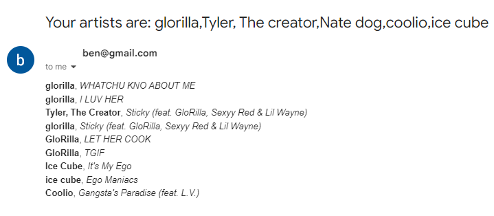

# Artist Email Scraper


This project is a Node.js application that scrapes the top rap songs from [PopVortex](http://www.popvortex.com/music/charts/top-rap-songs.php), filters songs based on specified artists, and emails the results to a specified address. The project uses the `axios` library to fetch the webpage, `cheerio` for HTML parsing, and `nodemailer` to send emails.

## Features
- Scrapes top 25 rap songs from PopVortex.
- Filters results based on artists specified in the command line.
- Supports artist names with multiple words and exceptions (e.g., "Tyler, the Creator").
- Handles featured artists (e.g., "feat. GloRilla, Sexyy Red & Lil Wayne").
- Sends an email containing the filtered song and artist information.

## Prerequisites
- Node.js installed on your system.
- Gmail account with app-specific password for Nodemailer.
- `credentials.json` file with the following structure:
  ```json
  {
      "from": "your-email@gmail.com",
      "to": "recipient-email@gmail.com",
      "senderEmail": "your-email@gmail.com",
      "senderPassword": "your-app-specific-password"
  }

## Installation 
1. Clone the repository and navigate to the project directory.
2. Install the required packages:
    - npm install axios cheerio nodemailer
3. Create credetials.json file in the root directory with your email credentials

# Usage

- To run the script, use the following command:
    - node artists.js "artist1" "artist2" ...

## Example
- node artists.js glorilla "Tyler, The Creator" "Nate Dogg" coolio "Ice Cube"

    This command will:

        - Scrape the top 25 rap songs from PopVortex.
        - Filter results for the specified artists (e.g., GloRilla, Tyler, The Creator, Nate Dogg, - Coolio, and Ice Cube).
        - Send an email containing the filtered results to the email specified in credentials.json.

Email output


## Error Handling

- If no matches are found for the specified artists, an email is not sent, and a message is displayed in the console.
- If there is an error fetching data from the webpage or reading the credentials, an error message is printed to the console.

## Notes

- Ensure that the Gmail account used has an app-specific password if 2-Step Verification is enabled.
- The application is limited to the top 25 songs from PopVortex.
- If artists are listed with commas or ampersands (e.g., "GloRilla & Sexyy Red"), each artist is handled individually for filtering.